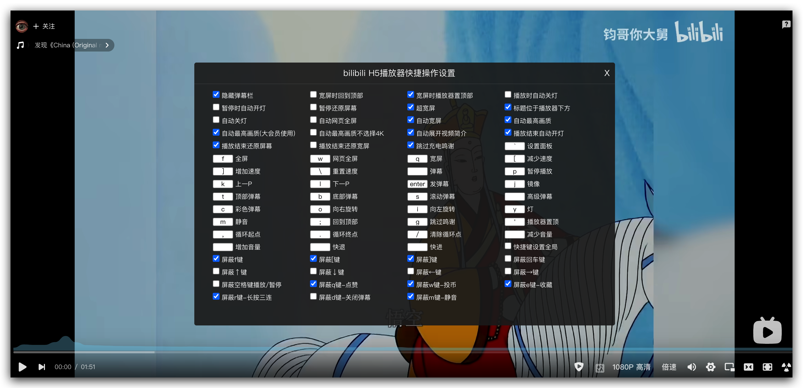

# bilibili-quickdo

Bilibili 桌面视频页用户脚本：用快捷键控制播放、切换屏幕模式、输入弹幕，并按偏好自动调整播放器。

本仓库是 [jeayu/bilibili-quickdo](https://github.com/jeayu/bilibili-quickdo) 的 fork，由 [nukewarrior/bilibili-quickdo](https://github.com/nukewarrior/bilibili-quickdo) 继续维护，针对新版播放器进行适配和修复。

- **播放控制**：暂停、倍速、静音、分 P 切换、按比例跳转和区间循环。
- **画面与弹幕**：全屏、网页全屏、宽屏、旋转、镜像、弹幕类型开关。
- **个性化设置**：自定义快捷键、自动宽屏、画质选择、弹幕栏隐藏和开关灯。

## 安装与快速开始

1. 安装 [Tampermonkey](https://www.tampermonkey.net/) 用户脚本管理器。
2. 打开本 fork 的 [GreasyFork 发布页](https://greasyfork.org/zh-CN/scripts/598993-bilibili-h5%E6%92%AD%E6%94%BE%E5%99%A8%E5%BF%AB%E6%8D%B7%E6%93%8D%E4%BD%9C)，点击“安装此脚本”。
3. 在用户脚本管理器中完成安装，确认脚本已启用。
4. 打开或刷新 `www.bilibili.com/video/BV…` 视频页，等待播放器加载，按 **反引号键** 打开设置面板。

如需源码安装或本地调试，打开本仓库的 [bilibili-quickdo.user.js](bilibili-quickdo.user.js)，通过 **Raw** 复制完整源码（包括顶部元数据），在管理器中新建脚本并替换模板后保存。具体步骤见[官方安装说明](https://www.tampermonkey.net/faq.php?q=Q102)。

更新手动安装的本地副本时，用本仓库源码替换已安装脚本并保存，再刷新视频页。保持一个副本启用，避免重复响应快捷键。

## 快捷键速查

以下为首次安装时的默认绑定；已有设置会覆盖默认值。字母键直接按下即可，不需要 Shift。

| 按键 | 操作 |
| --- | --- |
| 反引号 | 显示／隐藏设置面板 |
| `P` | 播放／暂停 |
| `F` / `W` / `Q` | 全屏／网页全屏／宽屏 |
| `[` / `]` | 减少／增加播放速度，每次 0.25 倍，范围 0.25–4 倍 |
| `\` | 恢复 1 倍速 |
| `M` | 静音／取消静音 |
| `K` / `L` | 上一 P／下一 P，需播放器提供对应按钮 |
| `0`–`9` | 跳到视频时长的 0%–90%，例如 `5` 跳到中点 |
| `Enter` | 显示弹幕输入框；在其中按 Enter 后收起输入框 |
| `D` | 开启／关闭弹幕 |
| `T` / `B` / `S` / `C` | 切换顶部／底部／滚动／彩色弹幕类型 |
| `J` | 切换镜像 |
| `I` / `O` | 向左／向右旋转 90° |
| `Y` | 开灯／关灯 |
| `;` / `'` | 回到页面顶部／滚动到播放器顶部 |
| `G` | 跳过充电鸣谢，需页面提供跳过按钮 |
| `,` / `.` / `/` | 设置循环起点／终点／清除循环点 |

循环起点需选在 0 秒之后，终点应晚于起点。音量增减、快进快退和高级弹幕开关没有默认按键，可在设置面板中绑定。

输入框或文本域获得焦点时，播放器快捷键暂停响应，弹幕输入框的 Enter 处理除外。带 Ctrl、Shift 或 Alt 的组合键不会触发脚本操作。

## 设置与默认行为

按反引号打开设置面板：勾选功能开关，或点击快捷键输入框后按下新按键。设置由用户脚本管理器持久保存；修改后刷新页面，可让启动和布局设置重新应用。



设置面板示例，截图中的配置可能与默认值不同。

首次安装时，以下设置默认开启：

| 设置 | 行为 |
| --- | --- |
| 隐藏弹幕栏 | 隐藏发送区域，按 Enter 显示输入框 |
| 自动宽屏 | 视频加载后切换为宽屏模式 |
| 超宽屏 | 宽屏模式扩展到窗口宽度 |
| 宽屏时播放器置顶部 | 宽屏时将播放器顶部对齐到原生导航下方；导航尚未加载时暂不滚动 |
| 标题位于播放器下方 | 通过 CSS 排序显示标题，保留原生 DOM 顺序 |
| 自动最高画质 | 选择列表中首个没有大会员标记的画质 |
| 自动展开视频简介 | 点击简介展开按钮 |
| 播放结束自动开灯 | 播放结束时尝试打开页面灯光 |
| 播放结束还原屏幕 | 播放结束时尝试退出当前屏幕模式 |
| 跳过充电鸣谢 | 播放结束时尝试点击跳过按钮 |

其余功能开关默认关闭，包括自动网页全屏、自动关灯、播放／暂停时切换灯光、暂停时还原屏幕、宽屏时回到顶部、播放结束还原宽屏、会员画质选项及全局快捷键模式。画质选择受账号权限和视频提供的档位限制。

普通和宽屏模式保留原生顶部导航。`'`（播放器置顶）同样对齐到导航下方；网页全屏和全屏模式下不执行此滚动。若同时开启两个宽屏定位选项，“宽屏时回到顶部”优先。

**与 Bilibili 原生快捷键的关系**：脚本默认屏蔽原生 `F`、`[`、`]`、`Q`、`W`、`E`、`R`、`D`、`M`。其中 `Q`、`W` 被用于屏幕模式；如需保留原生点赞、投币、收藏或三连操作，请调整脚本绑定，并取消设置面板中的对应“屏蔽”选项。

## 兼容范围

- 脚本匹配 `www.bilibili.com/video/av*`、`/video/bv*` 和 `/video/BV*` 路径。
- 未匹配番剧／影视的 `/bangumi/play/` 页面、直播页面或手机客户端。
- 本仓库已修复依赖旧顶部导航节点的初始化方式，改为等待播放器就绪；视频节点替换后会重新绑定事件。
- 回归检查覆盖初始化和事件绑定，尚未完成真实安装下全部功能的完整验证。屏幕、弹幕、画质和灯光操作依赖页面 DOM，播放器改版后可能需要继续适配。

## 常见问题

**安装后没有响应**

确认用户脚本管理器和脚本均已启用、当前 URL 在匹配范围内，并在播放器加载完成后尝试反引号键。Chrome／Edge 用户如遇执行权限提示，可按 [Tampermonkey 官方说明](https://www.tampermonkey.net/faq.php?q=Q209) 检查用户脚本执行权限。

**弹幕栏消失，或页面自动变宽**

这是默认设置。按 Enter 可显示弹幕输入框；如不需要自动布局，在设置面板中关闭“隐藏弹幕栏”“自动宽屏”或“超宽屏”，然后刷新页面。

**修改后没有生效，或一次按键触发两次**

确认管理器中保存的是修改后的源码，并只启用一个副本。自定义快捷键以已保存的绑定为准；在输入框中测试时，脚本会暂停响应。

**只有某个功能无效**

先确认页面是否提供对应按钮。反馈问题时，请提供视频链接、浏览器和用户脚本管理器版本、失效按键、复现步骤，以及脱敏后的控制台报错。

## 开发与贡献

运行代码、用户脚本元数据、注入的 HTML 和 CSS 均位于 `bilibili-quickdo.user.js`。项目没有依赖安装或构建步骤；检查需要 Node.js。

```sh
node --check bilibili-quickdo.user.js
node tests/player-init.test.cjs
git diff --check
```

依次执行语法检查、播放器回归检查和改动的空白检查。回归检查使用 Node.js 内置模块，覆盖初始化、视频节点替换、事件去重、输入框焦点保护、标题 DOM 顺序和导航下方定位。

修改后将源码保存到用户脚本管理器，手动检查设置面板、播放／暂停、全屏、弹幕输入、设置持久化，以及分 P 和画质切换。提交规范见 [AGENTS.md](AGENTS.md)。

## 许可证

[MIT](LICENSE)。原作者：jeayu。
